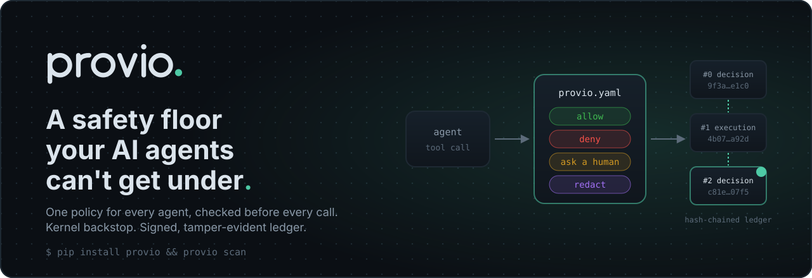
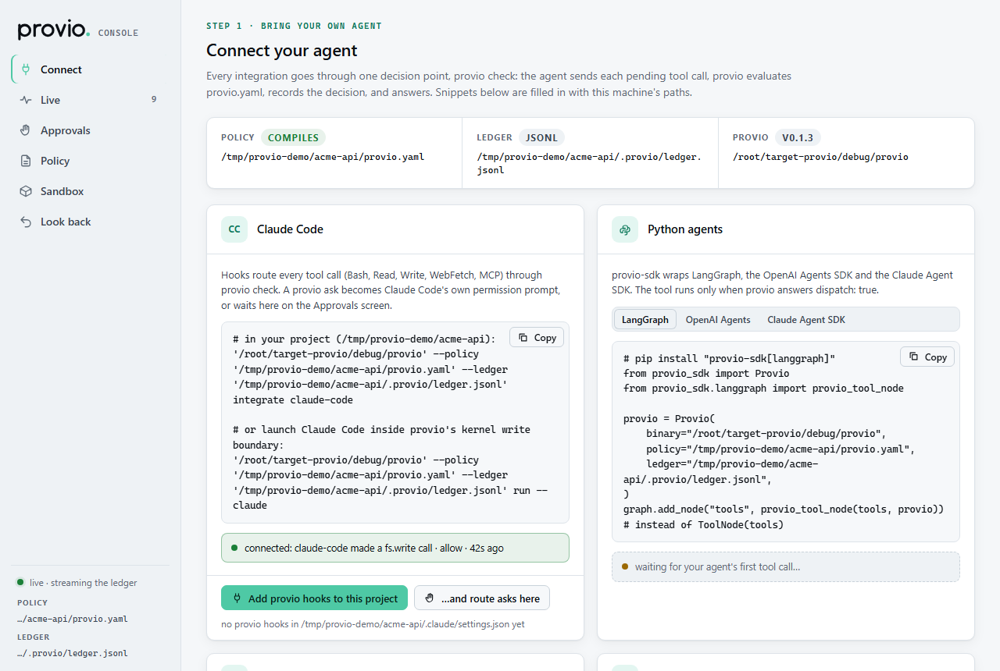
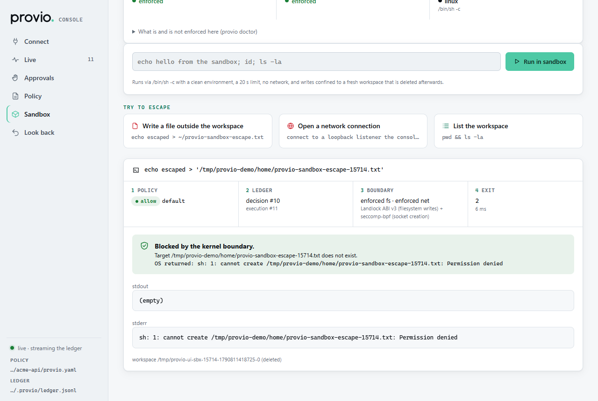

<div align="center">



Your agent asks. Your policy decides. The ledger remembers.

[](https://github.com/writ-agent/writ/actions/workflows/ci.yml)
[](LICENSE)
[](rust-toolchain.toml)
[](#status)
[](https://pypi.org/project/writ-sdk/)
[](https://www.npmjs.com/package/@writ-agent/sdk)

[Website](https://writ-omega.vercel.app) · [**Playground**](https://writ-omega.vercel.app/playground.html) · [Docs](docs/README.md) · [Threat model](docs/THREAT_MODEL.md) · [Changelog](CHANGELOG.md)

**Watch it catch what command checks miss.** [claude-code#88462](https://github.com/anthropics/claude-code/issues/88462): an agent's cleanup script ran `rm -rf "$HOME"`. writ refuses the script when it is written, refuses `bash cleanup.sh` by reading the script, and when the delete is obfuscated past every rule, the kernel boundary refuses it anyway. Reproduce it: [examples/incident-88462](examples/incident-88462/).





**See it block an injected agent.** A poisoned README tells the agent to read an SSH key, send it to `attacker.example` and `rm -rf` a directory; writ denies all three and the ledger proves it. Reproduce it offline: [examples/attack-demo](examples/attack-demo/) (scripted tool calls, real writ output).



</div>

**A safety floor your AI agents can't get under.** One policy for Claude Code,
Codex, Gemini CLI, Cursor, Windsurf, your SDK agents and your MCP servers,
checked before every tool call and judged by what the call will actually run
(the script behind `bash cleanup.sh`, a heredoc fed to a shell, the
`package.json` script behind `npm run`). Launched agents also run inside a
kernel write boundary for what no parser can see. Every decision lands in a
tamper-evident, signable ledger.

A writ is authority to act, and the written record that it was authorized:
for developers who run agents in auto mode with real credentials, and for the
platform teams who answer for what those agents did.

## 60 seconds

```bash
pip install writ-cli            # or: npm install -g @writ-agent/cli

writ scan                       # what would writ have caught in your agents' last 30 days?
writ init                       # a policy (the disaster floor + secrets guard) and hooks
                                # for every agent found here: Claude Code, Codex, Gemini, Cursor, Windsurf
writ test "rm -rf ~"            # try any command against your policy
```

`writ scan` reads the transcripts your agents already keep (Claude Code,
Codex, Gemini CLI) and replays every tool call through the policy. It
installs, hooks and records nothing, and `--format markdown` gives a
shareable summary with counts only. `writ init` never overwrites an existing
policy; `--global` wires your user-level agent config instead of one project.

The starter policy is `default: allow` plus two bundled packs, so agents stay
fast and only disasters stop them:

| The [`floor`](packs/floor/) pack refuses | and asks before |
|---|---|
| recursive deletes of `~`, `/`, `C:\`, your profile, `~/Documents` … (also inside scripts, `trap`, `sh -c`, `shutil.rmtree(Path.home())`) | `rm -rf .`, `.git`, `*` |
| `mkfs`, `dd of=/dev/…`, fork bombs, `chmod -R 777 /` | `git reset --hard`, `clean -f`, `checkout -- .` |
| force pushes to `main`/`master` | `DROP DATABASE`, `prisma migrate reset`, Redis `FLUSHALL` |
| reading SSH private keys and cloud credentials | `terraform destroy`, `gcloud projects delete`, `kubectl delete ns`, `aws s3 rm --recursive` |
| reverse shells | `curl … \| sh` |
| the agent rewriting its own hooks or `.writ/` ledger | edits to `writ.yaml` |
| launching agents with `--dangerously-skip-permissions`, `--yolo`, `--trust-all-tools` | cron, launchd, scheduled tasks, shell-profile edits |

Add more with one line (`packs: [floor, secrets-guard, github-safety, aws-safety]`).
20 packs ship inside the binary: cloud CLIs (AWS, GCP, Azure), GitHub, databases,
Kubernetes, Terraform, Docker, hosting platforms, CI/CD config, package
publishing, Windows/macOS/Linux host security, internet exposure, MCP
destructive tools, outbound email/chat, payments; see [packs/](packs/).
`writ scan --packs all` shows what all of them would have caught.

## Install

Prebuilt, signed binaries for Linux (x64, arm64, static), macOS (Apple
silicon, Intel) and Windows (x64). Pick one:

```bash
pip install writ-cli                 # Python users
npm install -g @writ-agent/cli       # Node users
curl -fsSL https://raw.githubusercontent.com/writ-agent/writ/main/scripts/install.sh | sh
irm https://raw.githubusercontent.com/writ-agent/writ/main/scripts/install.ps1 | iex   # Windows PowerShell
```

The install scripts check the binary against the release's `checksums.txt`
before installing it, and change nothing else (no PATH or profile edits).

or download `writ-<target>` from the
[latest release](https://github.com/writ-agent/writ/releases/latest)
(checksums, Sigstore bundles and build provenance attached). Then
`writ init` in your project, or launch an agent inside the kernel boundary:

```bash
writ run -- claude
```

No daemon, no images, no account. The default backend is the host OS, and the
first run creates `.writ/ledger.jsonl` next to your policy. For a SQLite
ledger, build with `--features sqlite` and pass `--ledger .writ/ledger.db`.

## Integrations

Every integration goes through one decision point, `writ check`
([Contract 6](docs/INTERFACES.md)): the agent sends a pending tool call, writ
evaluates `writ.yaml`, records the decision, and answers. No daemon; if writ
is missing or errors, the tool does not run.

| Agent | How | Per tool call |
|---|---|---|
| **Claude Code** | `writ integrate claude-code` (writes hooks into `.claude/settings.json`), or just `writ run -- claude` | yes — a writ `ask` becomes Claude Code's own permission prompt |
| **OpenAI Codex CLI** | `writ integrate codex` (`.codex/config.toml`), or `writ run -- codex` | yes |
| **Gemini CLI** | `writ integrate gemini` (`.gemini/settings.json`), or `writ run -- gemini` | yes — a writ `ask` becomes Gemini's confirmation |
| **Cursor** | `writ integrate cursor` (`.cursor/hooks.json`), or `writ run -- agent` | yes (MCP asks use Cursor's prompt) |
| **Windsurf** | `writ integrate windsurf` (`.devin/hooks.json`) | yes (asks are denied) |
| **LangGraph** | `writ_sdk.langgraph.writ_tool_node(tools, writ)` | yes |
| **OpenAI Agents SDK** | `writ_sdk.openai_agents.guard_agent(agent, writ)` | yes |
| **Claude Agent SDK** (Python / TypeScript) | `writ_sdk.claude_agent_sdk.writ_hooks(writ)` / `createWritIntegration({ client })` | yes |
| **Any MCP client** | `writ proxy --mcp --server <name> -- <server cmd>` (stdio), or `--transport http --upstream <url>` for remote servers; tool definitions are [pinned](docs/mcp-pins.md), so a changed one is held until you accept it | every MCP tool call |
| **Any other agent** | `writ run -- <agent>`: kernel-confined launch; or call `writ check` from its hook system | launch, plus hooks where the agent has them |

```bash
# Claude Code, per project
writ integrate claude-code

# Python — extras: langgraph, openai-agents, claude-agent-sdk
pip install "writ-sdk[langgraph]"

# TypeScript / Node
npm install @writ-agent/sdk
```

Both SDKs bring the prebuilt `writ` binary with them (`writ-cli` on PyPI,
`@writ-agent/cli` on npm) — nothing else to install.

Package docs: [Python](adapters/python/README.md) · [TypeScript](adapters/typescript/README.md) ·
per-agent notes and residual risks: [docs/integrations/](docs/integrations/).

## The console: `writ ui`

```bash
writ ui          # opens http://127.0.0.1:<port> in your browser
```

A local web console for the policy file and ledger in front of you: connect
an agent (snippets filled in with your paths, and a live "connected" signal
from the ledger), watch every decision as it is recorded, approve or deny
`ask` calls (`writ check --ask ui`), edit and test the policy, and run
commands in the kernel sandbox to watch an escape attempt fail with the exact
OS error. Loopback only, token-gated, no external requests. See
[docs/ui.md](docs/ui.md).

<p align="center">
  
  
</p>

No install needed to try the policy language itself: the
[playground](https://writ-omega.vercel.app/playground.html) runs the real
engine in your browser.

## The policy that produced that session

`writ.yaml` is the whole surface. Four verdicts, first match wins, unmatched
calls hit `default`.

```yaml
version: 1
default: ask                          # --yolo flips this to allow. Nothing else does.

rules:
  - id: block-destructive-shell
    when: tool == "bash" and command matches "rm -rf|mkfs|dd if=|:\(\)\{"
    verdict: deny
    reason: "Destructive system command. Narrow the path and retry."

  - id: protect-production-db
    when: tool startswith "postgres" and query matches "(?i)(DROP|TRUNCATE|ALTER)"
    verdict: ask
    irreversible: true                # excluded from automated replay
    timeout: 5m

  - id: egress-allowlist
    when: tool == "http" and not url.host in hosts.allowed
    verdict: deny

  - id: mask-pii
    when: tool startswith "postgres"
    verdict: redact
    patterns: ["[A-Za-z0-9._%+-]+@[A-Za-z0-9.-]+\\.[A-Za-z]{2,}"]

hosts:
  allowed: [api.github.com, registry.npmjs.org, "*.internal.acme.com"]
```

A denial is not a dead end. The agent receives the rule id, the human reason and
the `writ.yaml:6` that produced it, so it can correct itself instead of retrying
blind. The file lives in your repo, so the policy travels with the code and
reviews like code.

Start from a pack instead: `writ policy add terraform-safety` · `k8s-prod` ·
`pii-redaction`.

## The part that survives the session

Logs are what an application chose to write. A ledger is evidence: every call,
its verdict, the rule that decided it, who approved it, and the hash of the
record before it.

<div align="center">

</div>

Editing one line breaks the chain from that record onward, and `writ verify`
names the record it broke at. Nothing is captured beyond metadata and hashes
unless you turn content capture on, and Writ sends nothing anywhere — there is no
telemetry to opt out of.

## How it works

```
your agent, unchanged     Claude Code · Codex · LangGraph · your own loop
         │
         │  tool call intercepted
         ▼
┌─ writ ──────────────────────────────────────────────────────┐
│  1  INTERCEPT   mcp proxy  ·  process wrap  ·  sdk hook      │
│  2  DECIDE      writ.yaml → allow · deny · ask · redact      │
│  3  RECORD      hash-chained ledger  +  OTel GenAI span      │
└─────────┬───────────────────────────────────────────────────┘
          │  approved calls only
          ▼
   sandbox backend (local-os · docker · …)   ·   MCP servers
```

Writ wraps agents; it never asks you to adopt a runtime. The decision point is
the same in all three interception modes, and so is the record.

## Commands

| | |
|---|---|
| `writ run -- <agent>` | wrap an agent process under policy |
| `writ proxy --mcp --server <name> -- <cmd>` | govern every call to an MCP server |
| `writ log` · `writ show <call-id>` | what did my agent actually do last night |
| `writ verify` | is this ledger still the one that was written |
| `writ replay <session> --candidate <file>` | what would this policy have done to last week's run |
| `writ policy test` | unit-test rules against recorded fixtures |
| `writ doctor` | what is governed, and what is blind |
| `writ report` | one self-contained HTML file to hand to someone else |

## What writ does not do

Writ governs **actions**, not reasoning.

- **It does not stop prompt injection.** It shrinks the blast radius: least
  privilege, egress allow-lists, and a human gate on irreversible calls.
- **The ledger is tamper-evident, not tamper-proof; receipts make a rewrite
  detectable, not impossible.** `writ verify` catches edited records and broken
  links, but anyone with write access can rewrite the file and recompute the
  chain. A signed receipt (`writ receipt create`) pins every record up to a
  checkpoint, so a later edit, rewrite or truncation of those records fails
  `writ receipt verify` for anyone holding the receipt and your public key;
  anchoring it in the Sigstore Rekor public log (`writ receipt anchor --to rekor`)
  adds an independent timestamp. Records after the latest receipt are still only
  tamper-evident, and a stolen signing key or a host compromised before signing
  defeats receipts. See [docs/receipts.md](docs/receipts.md).
- **MCP-proxy-only mode is partial coverage.** The agent's own shell, file writes
  and direct HTTP go around it. Pair mode A with process wrap or SDK hooks, and
  run `writ doctor`, which says this out loud rather than scoring itself.
- **It does not reverse side effects.** A denied call never ran; an approved one
  is yours.

Full residual-risk table: [docs/THREAT_MODEL.md](docs/THREAT_MODEL.md).

## Compatibility

| Layer | Today | Next |
|---|---|---|
| Agents | Claude Code, Codex CLI, Gemini CLI, Cursor, Windsurf (hooks); LangGraph, OpenAI Agents SDK, Claude Agent SDK (Python + TypeScript); any MCP client; any process via `run` | more agent hook protocols as they are published |
| Interception | hook gateway (`writ check`), MCP proxy (stdio, Streamable HTTP / SSE), process wrap | — |
| Policy engines | native DSL, Rego, Cedar — one verdict IR, one fixture corpus | — |
| Sandbox backends | local-os with a kernel boundary (Landlock + seccomp · AppContainer + Job Object · Seatbelt), docker | microsandbox, e2b/firecracker, k8s |
| Ledger stores | JSONL (every platform), SQLite WAL (`sqlite` feature), Postgres (`postgres` feature); signed receipts with Rekor anchoring | object-store export |
| Platforms | macOS, Linux, Windows — CI builds all three | six release targets |

## Compared to the neighbours, fairly

- **Agent hooks** (vendor hooks, the Leash/Fence/Cordon cluster) — per-agent and
  per-machine, with no portable policy and no verifiable record. Writ's policy
  moves with the repo; the ledger outlives the session.
- **Sandboxes** (E2B, microsandbox, Dagger) — real isolation, but no per-call
  decision point, no "ask me first", and no evidence of what was attempted. Writ
  drives them rather than replacing them.
- **MCP gateways** (Docker MCP Gateway, ContextForge) — govern MCP traffic, and
  are blind to the shell command the agent runs itself.
- **Observability** (Langfuse, Phoenix, LangSmith) — they watch. They cannot stop
  anything, and their output is application logs, not evidence.

## Status

Pre-release. The core spine, all three policy engines, both workstation
ledger stores and the kernel sandbox are built and tested on Linux, macOS
and Windows in CI; the enterprise wave is in progress. Twelve crates, one
frozen record schema.

| Wave | Scope | State |
|---|---|---|
| 0 | Frozen contracts, threat model, ADRs, CI | done |
| 1 | Native policy engine, ledger + verify, MCP stdio proxy, local-os sandbox, approval gate, CLI | done |
| 2 | `doctor`, `report`, replay trio, `policy test`, OTel spans, release pipeline | done |
| 2 | Kernel sandbox (Landlock/seccomp · AppContainer · Seatbelt), docker backend, SQLite ledger, benchmarks | done — confining `writ run` itself is open |
| 3 | Rego + Cedar | done |
| 3 | SDK hooks and the hook gateway | done |
| 3 | Postgres ledger, signed + anchored receipts, console (`writ ui`), Codex / Gemini / Cursor / Windsurf hooks, MCP over HTTP | done |
| 3 | Helm / SSO / RBAC / SIEM | not started |
| 4 | Fuzzing (running weekly), e2e matrix, published benchmarks, 1.0 | in progress |

`writ doctor` is the authority on what your build actually enforces. The plan and
its honest wave status live in
[docs/internal/BUILD_PLAN.md](docs/internal/BUILD_PLAN.md).

## Repository layout

| Path | What lives there |
|---|---|
| `crates/writ-core` | Frozen contracts: call, verdict IR, ledger record, sandbox, approver, pipeline |
| `crates/writ-policy`, `-rego`, `-cedar` | The three policy engines behind one `PolicyEngine` trait |
| `crates/writ-ledger` | Hash chain, JSONL / SQLite / Postgres stores, `verify` |
| `crates/writ-receipts` | Signed receipts, Merkle inclusion proofs, Rekor and file anchors |
| `crates/writ-sandbox`, `-docker` | `local-os` kernel boundary and the docker backend |
| `crates/writ-mcp` | MCP stdio proxy |
| `crates/writ-cli`, `writ-tui` | The `writ` binary, its approval gate, and the `writ ui` console |
| `crates/writ-wasm` | The engine compiled to WebAssembly for the playground |
| `crates/writ-replay`, `writ-otel` | Trajectory replay and OpenTelemetry spans |
| `crates/writ-bench`, `fuzz/` | Criterion benches and cargo-fuzz targets (standalone crates) |
| `packs/`, `examples/` | Policy packs and example `writ.yaml` files |
| `adapters/python`, `adapters/typescript` | `writ-sdk` (Python) and `@writ-agent/sdk` (TypeScript) integration packages |
| `deploy/` | GitHub Action, Helm chart, air-gap and Terraform notes |
| `docs/` | Policy reference, interfaces, threat model, ADRs — [index](docs/README.md) |
| `site/` | The landing page and the playground |

## Contributing

DCO sign-off, no CLA. Security-path changes (policy, ledger, MCP, sandbox) get an
adversarial review before merge. See [CONTRIBUTING.md](CONTRIBUTING.md) and
[docs/SECURITY.md](docs/SECURITY.md).

[Threat model](docs/THREAT_MODEL.md) ·
[Policy reference](docs/policy-reference.md) ·
[Interfaces](docs/INTERFACES.md) ·
[Decisions](docs/DECISIONS.md) ·
[Brand](docs/BRAND.md)

Apache-2.0, permanently. **WRIT — Warranted Runtime for Intelligent Tools.**
